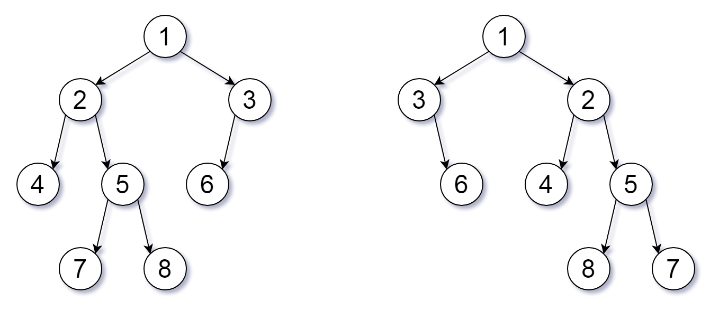

## 题目描述

我们可以为二叉树 T 定义一个翻转操作，如下所示：选择任意节点，然后交换它的左子树和右子树。

只要经过一定次数的翻转操作后，能使 X 等于 Y，我们就称二叉树 X 翻转等价于二叉树 Y。

编写一个判断两个二叉树是否是翻转等价的函数。这些树由根节点 root1 和 root2 给出。

示例：
```
输入：root1 = [1,2,3,4,5,6,null,null,null,7,8], root2 = [1,3,2,null,6,4,5,null,null,null,null,8,7]  
输出：true  
解释：我们翻转值为 1，3 以及 5 的三个节点。
```


提示：

每棵树最多有 100 个节点。  
每棵树中的每个值都是唯一的、在 [0, 99] 范围内的整数。

来源：力扣（LeetCode）  
链接：https://leetcode-cn.com/problems/flip-equivalent-binary-trees  
著作权归领扣网络所有。商业转载请联系官方授权，非商业转载请注明出处。

## 我的开始思路

递归

## 代码

- 语言支持：C#

```C#
        public bool FlipEquiv(TreeNode root1, TreeNode root2)
        {

            if (root1 == null && root2 == null) return true;
            else if (root1 == null && root2 != null) return false;
            else if (root1 != null && root2 == null) return false;
            else if (root1.val != root2.val) return false;

            //两个跟结点都不为空
            if (root1.left == null && root1.right == null && root2.left == null && root2.right == null)
            {
                if (root1.val == root2.val) return true;
                else return false;
            }
            else
            {
                var tmp = FlipEquiv(root1.left, root2.left);

                if (tmp)
                {
                    return FlipEquiv(root1.right, root2.right);
                }
                else
                {
                    tmp = FlipEquiv(root1.left, root2.right);

                    if (tmp == false) return false;
                    else return FlipEquiv(root1.right, root2.left);
                }
            }
        }
```

## 学习他人的思路

- 可以优化写法

最后需要继续遍历时可以写的比较简洁而且可读性也比较高

- 标准态遍历

让树中所有节点的左孩子都小于右孩子，如果当前不满足就翻转。我们把这种状态的二叉树称为 标准态。所有等价二叉树在转换成标准态后都是完全一样的。

## 代码

- 语言支持：C#
- 优化

```C#
     public bool FlipEquiv(TreeNode root1, TreeNode root2) 
     {
        
        if (root1 == root2) return true;

        if (root1 == null || root2 == null || root1.val != root2.val)
            return false;

        return (FlipEquiv(root1.left, root2.left) && FlipEquiv(root1.right, root2.right) ||
                FlipEquiv(root1.left, root2.right) && FlipEquiv(root1.right, root2.left));

    }
```

## 所学、所悟

还是那句话，感觉做递归很有用

**不去管函数的内部细节是如何处理的，我们只看其函数作用以及输入与输出**
