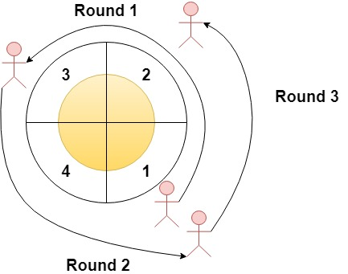

# 第一题

## 题目描述

5495.圆形赛道上经过次数最多的扇区

给你一个整数 n 和一个整数数组 rounds 。有一条圆形赛道由 n 个扇区组成，扇区编号从 1 到 n 。  
现将在这条赛道上举办一场马拉松比赛，该马拉松全程由 m 个阶段组成。  
其中，第 i 个阶段将会从扇区 rounds[i - 1] 开始，到扇区 rounds[i] 结束。  
举例来说，第 1 阶段从 rounds[0] 开始，到 rounds[1] 结束。



请你以数组形式返回经过次数最多的那几个扇区，按扇区编号 升序 排列。

注意，赛道按扇区编号升序逆时针形成一个圆（请参见第一个示例）。

示例 1：
```
输入：n = 4, rounds = [1,3,1,2]
输出：[1,2]
解释：本场马拉松比赛从扇区 1 开始。经过各个扇区的次序如下所示：
1 --> 2 --> 3（阶段 1 结束）--> 4 --> 1（阶段 2 结束）--> 2（阶段 3 结束，即本场马拉松结束）
其中，扇区 1 和 2 都经过了两次，它们是经过次数最多的两个扇区。扇区 3 和 4 都只经过了一次。
```
示例 2：
```
输入：n = 2, rounds = [2,1,2,1,2,1,2,1,2]
输出：[2]
```
示例 3：
```
输入：n = 7, rounds = [1,3,5,7]
输出：[1,2,3,4,5,6,7]
```
提示：
```
2 <= n <= 100
1 <= m <= 100
rounds.length == m + 1
1 <= rounds[i] <= n
rounds[i] != rounds[i + 1] ，其中 0 <= i < m
```
来源：力扣（LeetCode）  
链接：https://leetcode-cn.com/problems/most-visited-sector-in-a-circular-track  
著作权归领扣网络所有。商业转载请联系官方授权，非商业转载请注明出处。

## 我的思路

只关心起点和最后一圈的数字，中间满圈的对于所有位置都一样

但是太想当然了，没有考虑尽可能多的情况，导致提交了很多遍总有问题

## 代码

- 语言支持C#

```C#
        public IList<int> MostVisited(int n, int[] rounds)
        {
            IList<int> result = new List<int>();

            if (rounds[^1] >= rounds[0])
            {
                for (int i = rounds[0]; i <= rounds[^1]; i++)
                {
                    result.Add(i);
                }
            } 
            else
            {
                for (int i = 1; i <= rounds[^1]; i++)
                {
                    result.Add(i);
                }
                
                for (int i = rounds[0]; i <= n; i++)
                {
                    result.Add(i);
                }
            }

            return result;
        }
```

# 第二题

## 题目描述

5496.你可以获得的最大硬币数目

有 3n 堆数目不一的硬币，你和你的朋友们打算按以下方式分硬币：

每一轮中，你将会选出 任意 3 堆硬币（不一定连续）。  
Alice 将会取走硬币数量最多的那一堆。  
你将会取走硬币数量第二多的那一堆。  
Bob 将会取走最后一堆。  
重复这个过程，直到没有更多硬币。  
给你一个整数数组 piles ，其中 piles[i] 是第 i 堆中硬币的数目。

返回你可以获得的最大硬币数目。

示例 1：
```
输入：piles = [2,4,1,2,7,8]
输出：9
解释：选出 (2, 7, 8) ，Alice 取走 8 枚硬币的那堆，你取走 7 枚硬币的那堆，Bob 取走最后一堆。
选出 (1, 2, 4) , Alice 取走 4 枚硬币的那堆，你取走 2 枚硬币的那堆，Bob 取走最后一堆。
你可以获得的最大硬币数目：7 + 2 = 9.
考虑另外一种情况，如果选出的是 (1, 2, 8) 和 (2, 4, 7) ，你就只能得到 2 + 4 = 6 枚硬币，这不是最优解。
```
示例 2：
```
输入：piles = [2,4,5]
输出：4
```
示例 3：
```
输入：piles = [9,8,7,6,5,1,2,3,4]
输出：18
```
提示：
```
3 <= piles.length <= 10^5
piles.length % 3 == 0
1 <= piles[i] <= 10^4
```
来源：力扣（LeetCode）  
链接：https://leetcode-cn.com/problems/maximum-number-of-coins-you-can-get  
著作权归领扣网络所有。商业转载请联系官方授权，非商业转载请注明出处。

## 我的思路

要让次大数的和最大，那么，只要保证Bob每次取最小，Alice从最大数开始每隔一个取一个值

那么要先排序

## 代码

- 语言支持C#

```C#
        public int MaxCoins(int[] piles)
        {
            if (piles.Length == 0) return 0;

            Array.Sort(piles);

            int sum = 0;
            int count = 0;

            for (int i = piles.Length - 2; i >= 0; i -= 2)
            {
                count++;
                sum += piles[i];

                if (count >= piles.Length / 3) break;
            }

            return sum;
        }
```

# 第三题

## 题目描述

5497.查找大小为 M 的最新分组

给你一个数组 arr ，该数组表示一个从 1 到 n 的数字排列。有一个长度为 n 的二进制字符串，该字符串上的所有位最初都设置为 0 。

在从 1 到 n 的每个步骤 i 中（假设二进制字符串和 arr 都是从 1 开始索引的情况下），二进制字符串上位于位置 arr[i] 的位将会设为 1 。

给你一个整数 m ，请你找出二进制字符串上存在长度为 m 的一组 1 的最后步骤。一组 1 是一个连续的、由 1 组成的子串，且左右两边不再有可以延伸的 1 。

返回存在长度 恰好 为 m 的 一组 1  的最后步骤。如果不存在这样的步骤，请返回 -1 。

示例 1：
```
输入：arr = [3,5,1,2,4], m = 1
输出：4
解释：
步骤 1："00100"，由 1 构成的组：["1"]
步骤 2："00101"，由 1 构成的组：["1", "1"]
步骤 3："10101"，由 1 构成的组：["1", "1", "1"]
步骤 4："11101"，由 1 构成的组：["111", "1"]
步骤 5："11111"，由 1 构成的组：["11111"]
存在长度为 1 的一组 1 的最后步骤是步骤 4 。
```
示例 2：
```
输入：arr = [3,1,5,4,2], m = 2
输出：-1
解释：
步骤 1："00100"，由 1 构成的组：["1"]
步骤 2："10100"，由 1 构成的组：["1", "1"]
步骤 3："10101"，由 1 构成的组：["1", "1", "1"]
步骤 4："10111"，由 1 构成的组：["1", "111"]
步骤 5："11111"，由 1 构成的组：["11111"]
不管是哪一步骤都无法形成长度为 2 的一组 1 。
```
示例 3：
```
输入：arr = [1], m = 1
输出：1
```
示例 4：
```
输入：arr = [2,1], m = 2
输出：2
```
 
提示：
```
n == arr.length
1 <= n <= 10^5
1 <= arr[i] <= n
arr 中的所有整数 互不相同
1 <= m <= arr.length
```
来源：力扣（LeetCode）  
链接：https://leetcode-cn.com/problems/find-latest-group-of-size-m  
著作权归领扣网络所有。商业转载请联系官方授权，非商业转载请注明出处。

## 我的思路

直接想到的是暴力解法，完全模拟题目描述，时间复杂度O(N^2)

果然无法通过

# 代码

- 语言支持C#

```C#
        public int FindLatestStep(int[] arr, int m)
        {
            int count = 0;
            int result = -1;

            List<int> list = new List<int>();

            for (int i = 0; i <= arr.Length + 1; i++)
            {
                list.Add(i);
            }

            for (int i = 0; i <= arr.Length - 1; i++)
            {
                count++;
                RemoveIndex(list, arr[i]);

                if (count < m) continue;
                if (IsHaveArr(list, m)) result = count;
            }

            return result;
        }

        private void RemoveIndex(List<int> list, int index)
        {
            for (int i = 0; i < list.Count; i++)
            {
                if (list[i] == index)
                {
                    list.RemoveAt(i);
                    break;
                }
            }
        }

        private bool IsHaveArr(List<int> list, int m)
        {
            int last = list[0];

            foreach (var item in list)
            {
                if (item - last - 1 == m) return true;
                else last = item;
            }

            return false;
        }
```

## 学习他人的思路

- 法一

首先题目转换为从全1变为全0，那么是要去找第一次出现m长度的全1段

一开始的全1段时从0到传入队列长度，当按照倒叙把某位置1变为0时，全1段被分为了两部分

不断重复上一步骤，直到出现长度m的全1段

但是，在java的TreeSet和C++中的map可以直接找第一个比某index大的或小的值，而C#中目前没有找到

然后我用C#中的排序字典+二分查找的方法把时间复杂度优化到O(NlogN),可是还是超时

- 法二

通过维护两个数组来完成

第一个数组用来记录每个位置全1段的长度；第二个数组用来记录每个长度目前有几个

当遍历是，有4中情况，两边全为0，左0右1，右0左1，右1左1，分别处理即可

但是此时再处理后3中情况时，要变更相连的全部位置的长度数组，那么时间复杂度为O(N^2)

而因为当中间全为1是，就不会再设置这中间的值了，那么就算不更改中间字段的长度数组，也不会影响后续

那么只需要把全1段两边边界的长度维护一下就可以了，时间复杂度将为O(N)

## 代码

- 语言支持C#
- 法一

```C#
        public int FindLatestStep1(int[] arr, int m)
        {
            if (m == arr.Length) return m;

            SortedDictionary<int, int> dict = new SortedDictionary<int, int> { { 0, arr.Length + 1 } };

            for (int i = arr.Length - 1; i >= 0; i--)
            {
                int start = 0;
                int end = dict.Count;

                while (start <= end)
                {
                    int mid = (start + end) / 2;

                    var item = dict.ElementAt(mid);

                    if (item.Key < arr[i] && item.Value > arr[i])
                    {
                        int left = arr[i] - item.Key - 1;
                        int right = item.Value - arr[i] - 1;

                        if (left == m || right == m) return i;

                        dict[item.Key] = arr[i];
                        dict.Add(arr[i], item.Value);

                        break;
                    }
                    else if (item.Key < arr[i])
                    {
                        start = mid + 1;

                    }
                    else
                    {
                        end = mid - 1;
                    }
                }
            }

            return -1;
        }
```

- 语言支持C#
- 法二

```C#
        public int FindLatestStep2(int[] arr, int m)
        {
            if (m == arr.Length) return m;

            int result = -1;

            int[] len = new int[arr.Length + 2];
            int[] cnt = new int[arr.Length + 2];

            for (int i = 0; i < arr.Length; i++)
            {
                if (cnt[m] > 0) result = i;

                if (len[arr[i] - 1] == 0 && len[arr[i] + 1] == 0)
                {
                    len[arr[i]] = 1;
                    cnt[1]++;
                }
                else if (len[arr[i] - 1] == 0)
                {
                    len[arr[i]] = len[arr[i] + 1] + 1;
                    cnt[len[arr[i] + 1]]--;
                    len[arr[i] + len[arr[i]+1]] = len[arr[i]];
                    cnt[len[arr[i]]]++;

                }
                else if (len[arr[i] + 1] == 0)
                {
                    len[arr[i]] = len[arr[i] - 1] + 1;
                    cnt[len[arr[i] - 1]]--;
                    len[arr[i] - len[arr[i]-1]] = len[arr[i]];
                    cnt[len[arr[i]]]++;
                }
                else
                {
                    len[arr[i]] = len[arr[i] + 1] + len[arr[i] - 1] + 1;
                    cnt[len[arr[i] + 1]]--;
                    cnt[len[arr[i] - 1]]--;
                    len[arr[i] + len[arr[i]+1]] = len[arr[i]];
                    len[arr[i] - len[arr[i]-1]] = len[arr[i]];
                    cnt[len[arr[i]]]++;
                }
            }

            return result;
        }
```

# 第四题

## 题目描述


## 我的思路


## 学习他人思路

## 代码

- 语言支持C#

```

```
